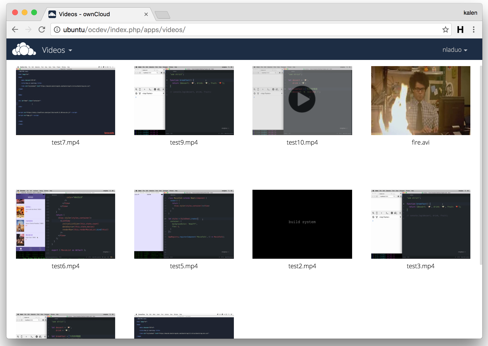

# owncloud-videos
An [ownCloud](https://owncloud.org/) videos app. 

## Dependency
1. [files_videoplayer](https://github.com/owncloud/files_videoplayer) <br>
2. [ffmpeg](http://ffmpeg.org/)

## Installation
```
cd owncloud/apps    # enter the ownCloud apps directory
git clone https://github.com/nladuo/owncloud-videos.git ./videos/
chown www-data:www-data -R videos/thumbnails      # make sure the webserver can modify the thumbnails directory.
```

## ScreenShot


## LICENSE
MIT