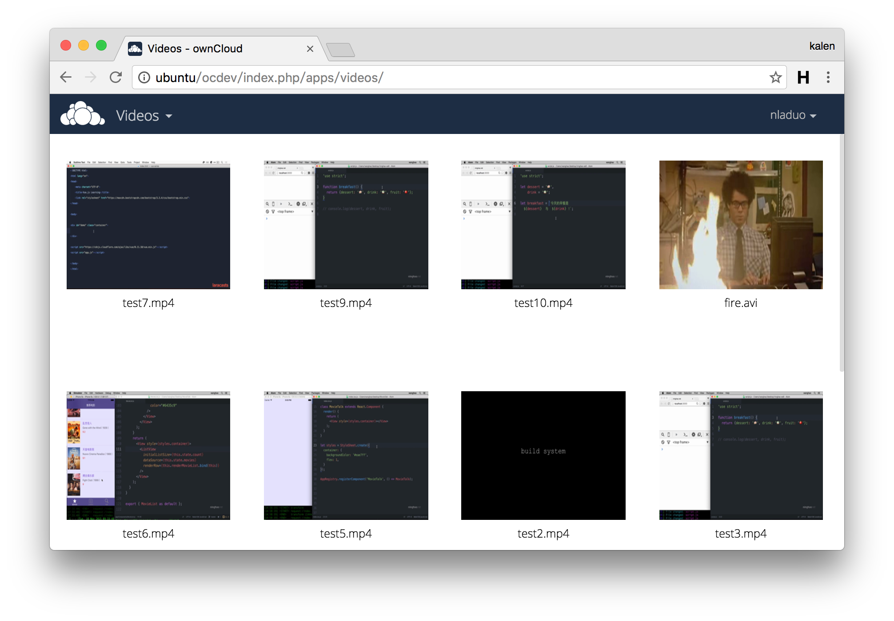

# owncloud-videos
An [ownCloud](https://owncloud.org/) videos app. 

## Dependency
1. [files_videoplayer](https://github.com/owncloud/files_videoplayer) <br>
2. [ffmpeg](http://ffmpeg.org/)

## Installation
1. enter apps directory
```
cd owncloud/apps 
```
2. clone the repository
```
git clone https://github.com/nladuo/owncloud-videos.git ./videos/
```
3. make the `videos/thumbnails` directory can be written.
```
chown www-data:www-data -R videos/thumbnails 
```

## ScreenShot


## LICENSE
MIT